# Examples & Tutorials

Hands-on notebooks covering algorithms, CI tests, and the full discovery-to-estimation pipeline.

---

## Tutorials

<div class="ct-gallery">

<a href="beginers_guide.html" class="ct-gallery-item" data-tooltip="Beginner-friendly introduction: causation vs correlation, discovery vs inference, assumptions, constraint-based vs score-based methods, and nonstationarity handling.">
  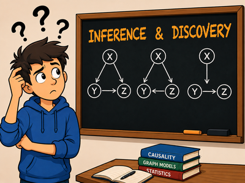
  <span class="ct-gallery-title">Beginner's Guide</span>
</a>

<a href="../tutorial.html" class="ct-gallery-item" data-tooltip="Full walkthrough of CDNOTS, CDNOTS+, CEDAR, and GRACE — data generation, discovery, evaluation, and visualization.">
  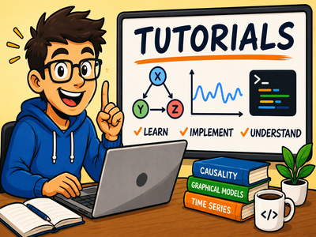
  <span class="ct-gallery-title">Getting Started Tutorial</span>
</a>

<a href="api_reference.html" class="ct-gallery-item" data-tooltip="Interactive reference for all CI tests, discovery algorithms, and plotting utilities with worked examples.">
  
  <span class="ct-gallery-title">API Reference Notebook</span>
</a>

</div>

---

## CEDAR Deep Dives

CEDAR (Causal Edge Discovery for Autoregressive processes) is a scalable pairwise causal discovery algorithm for autoregressive time series. It uses minimum-lag selection to reduce the search to two CI tests per candidate edge — O(d²) overall — and supports single-target discovery at O(d). See [arXiv:2507.07898](https://arxiv.org/abs/2507.07898).

<div class="ct-gallery">

<a href="cedar_benchmark.html" class="ct-gallery-item" data-tooltip="CDNOTS+ and CEDAR benchmarked at d=5,10,20,30 — F1, precision, recall, SHD, and wall-clock runtime compared on random sparse SCPs with T=300.">
  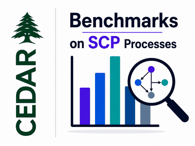
  <span class="ct-gallery-title">Scaling Benchmark</span>
</a>

<a href="cedar_deep_dive.html" class="ct-gallery-item" data-tooltip="CEDAR deep dive: multi-lag testing, MCI pruning, target-variable mode, d=20 scaling, nonlinear CI tests — systematic comparison vs CDNOTS.">
  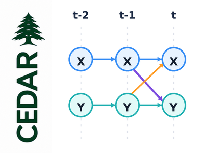
  <span class="ct-gallery-title">CEDAR Deep Dive</span>
</a>

<a href="cedar_lag_selection.html" class="ct-gallery-item" data-tooltip="Compare lag selection methods (dcor, dcor_biased, pearson) and p-value methods (t_test, circular_shift) — F1, precision, runtime, and the Ramsey RESET linearity guide.">
  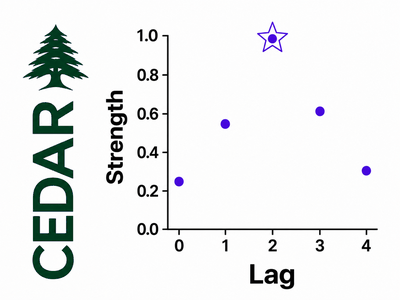
  <span class="ct-gallery-title">Lag Selection Guide</span>
</a>

</div>

---

## GRACE Deep Dives

Notebooks reproducing experiments from the GRACE paper (preprint forthcoming) with exact data generation settings.

<div class="ct-gallery">

<a href="grace_high_dim.html" class="ct-gallery-item" data-tooltip="GRACE vs CDNOTS at d=30 — paper data settings, gate value heatmaps, and the bimodal gate distribution that makes the 0.5 threshold reliable.">
  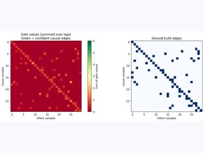
  <span class="ct-gallery-title">High-Dimensional (d=30)</span>
</a>

<a href="grace_ablation.html" class="ct-gallery-item" data-tooltip="Two ablations: (A) GRACE robustness to over/under-specified max_lag; (B) Lorenz-96 multiplicative dynamics — testing GRACE beyond its additive assumption.">
  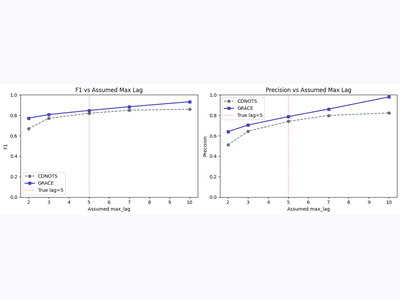
  <span class="ct-gallery-title">Lag Misspec & Lorenz-96</span>
</a>

</div>

---

## Examples

<div class="ct-gallery">

<a href="effect_estimation.html" class="ct-gallery-item" data-tooltip="End-to-end DoWhy integration: estimate causal effects, fit SCMs, run counterfactuals, root cause analysis, and graph falsification.">
  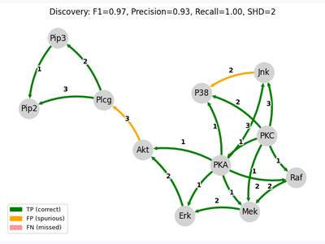
  <span class="ct-gallery-title">Effect Estimation</span>
</a>

<a href="probabilistic_queries.html" class="ct-gallery-item" data-tooltip="Interventional and observational queries on fitted SCMs — what-if analysis with soft/hard conditioning and distribution visualization.">
  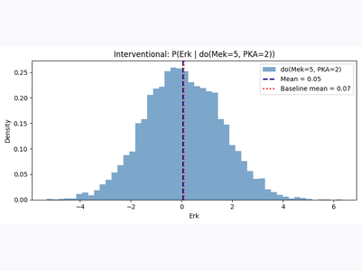
  <span class="ct-gallery-title">Probabilistic Queries</span>
</a>

<a href="missing_values.html" class="ct-gallery-item" data-tooltip="Handling incomplete data: pairwise-complete masking, VAR-EM imputation, and causal iterative imputation strategies.">
  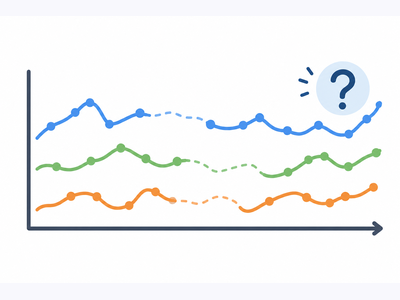
  <span class="ct-gallery-title">Missing Values</span>
</a>

<a href="mixed_data.html" class="ct-gallery-item" data-tooltip="Automatic discrete column detection, stratified CI testing for mixed data types.">
  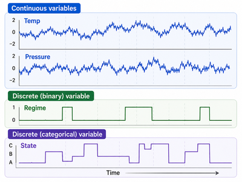
  <span class="ct-gallery-title">Mixed Data</span>
</a>

<a href="plotting.html" class="ct-gallery-item" data-tooltip="Comprehensive visualization guide: custom edge colors, target node highlighting, subgraph extraction, layouts, and comparison plots.">
  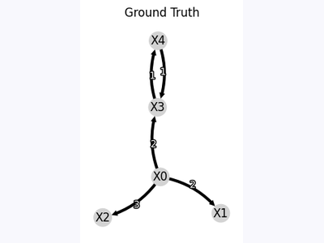
  <span class="ct-gallery-title">Visualization Guide</span>
</a>

<a href="ci_test_comparison.html" class="ct-gallery-item" data-tooltip="All 8 CI tests benchmarked on ex1/ex2/ex3 and a nonstationary dataset — F1, Precision, SHD and runtime across multiple sample sizes.">
  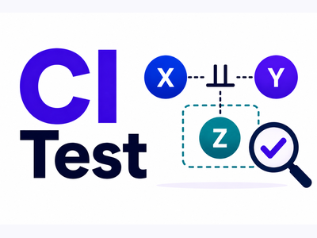
  <span class="ct-gallery-title">CI Test Comparison</span>
</a>

<a href="background_knowledge.html" class="ct-gallery-item" data-tooltip="Forbid and require edges using domain knowledge — showing how domain constraints can meaningfully improve discovery results.">
  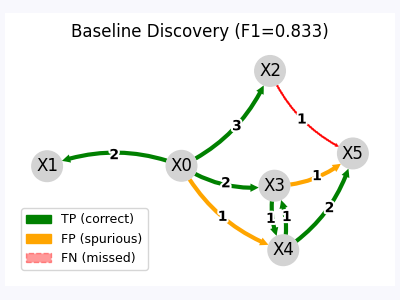
  <span class="ct-gallery-title">Background Knowledge</span>
</a>

<a href="baseline_comparison.html" class="ct-gallery-item" data-tooltip="CDNOTS and CEDAR vs. GES, VARLiNGAM, and Granger on three datasets — constraint-based methods against standard baselines.">
  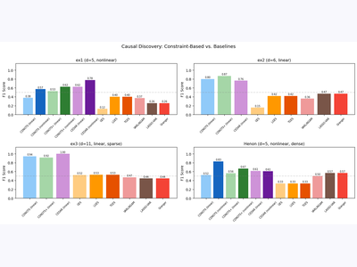
  <span class="ct-gallery-title">Baseline Comparison</span>
</a>

<a href="cdnots_or_cdnots_plus.html" class="ct-gallery-item" data-tooltip="When does the PCMCI+-style two-phase skeleton help vs hurt? Systematic comparison across scale-free, Erdos-Renyi, and small-world topologies.">
  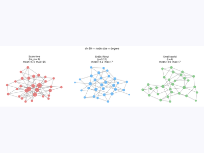
  <span class="ct-gallery-title">CDNOTS or CDNOTS+?</span>
</a>

<a href="multi_c_nonstationarity.html" class="ct-gallery-item" data-tooltip="How to choose the right C node basis for different nonstationarity patterns — quadratic trends, seasonal effects, regime changes.">
  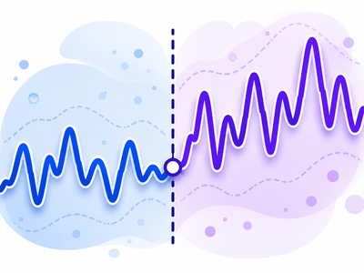
  <span class="ct-gallery-title">Multi-C Nonstationarity</span>
</a>

<a href="elbe_river.html" class="ct-gallery-item" data-tooltip="GRACE on 12-station river flow data with temporal bootstrap — recovering causal flow structure from nonstationary real-world time series.">
  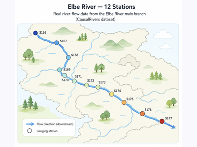
  <span class="ct-gallery-title">Elbe River Network</span>
</a>

<a href="forecasting.html" class="ct-gallery-item" data-tooltip="Graph-informed forecasting using discovered causal structure — causal vs all-lags baseline, exogenous regressors, multi-step horizon.">
  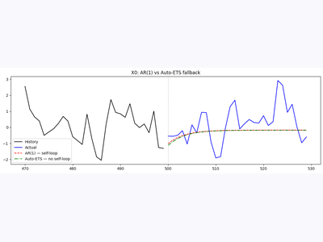
  <span class="ct-gallery-title">Causal Forecasting</span>
</a>

<a href="weather_benchmark.html" class="ct-gallery-item" data-tooltip="Real-world-inspired benchmark: 6-hourly wind/cloud for 8 Texas stations, Weibull wind model, cubic power curve, known 38-edge ground truth.">
  
  <span class="ct-gallery-title">ERCOT Weather Benchmark</span>
</a>

<a href="tigramite_integration.html" class="ct-gallery-item" data-tooltip="Run PCMCI+, PCMCI, LPCMCI from tigramite with causal-ts GPU CI tests — head-to-head comparison with CDNOTS.">
  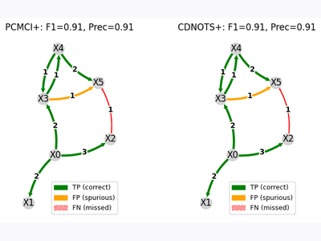
  <span class="ct-gallery-title">Tigramite Integration</span>
</a>

<a href="custom_algorithm.html" class="ct-gallery-item" data-tooltip="Step-by-step guide to registering a custom algorithm: subclass CausalResult, decorate with @register_algorithm, and get plotting + DoWhy bridge for free. Worked example: Granger causality.">
  
  <span class="ct-gallery-title">Custom Algorithm Plugin</span>
</a>

<a href="regime_discovery.html" class="ct-gallery-item" data-tooltip="PELT changepoint detection + per-regime CEDAR/CDNOTS+ discovery for variable-lag systems. Compares with RPCMCI (tigramite).">
  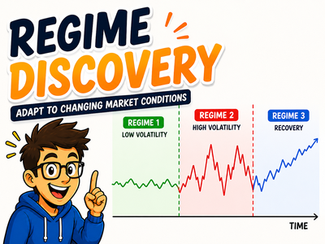
  <span class="ct-gallery-title">Regime Discovery</span>
</a>

</div>

---

```{toctree}
:hidden:
:maxdepth: 1

beginers_guide
../tutorial
api_reference
cedar_benchmark
cedar_deep_dive
cedar_lag_selection
grace_high_dim
grace_ablation
effect_estimation
probabilistic_queries
missing_values
mixed_data
plotting
ci_test_comparison
background_knowledge
baseline_comparison
cdnots_or_cdnots_plus
multi_c_nonstationarity
elbe_river
forecasting
weather_benchmark
tigramite_integration
custom_algorithm
regime_discovery
```
