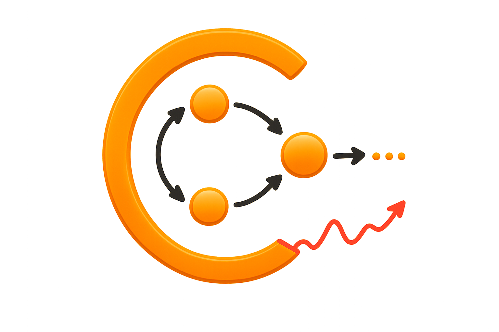

---
html_meta:
  "description": "Causal discovery for nonstationary time series — CDNOTS, CDNOTS+, CEDAR, GRACE, 8 GPU CI tests"
---

```{toctree}
:hidden:
:maxdepth: 2

getting_started/index
algorithms
ci_tests
examples/index
api/index
cli
```

<div class="ct-hero">
  <div class="ct-hero-inner">
    
    <div class="ct-hero-text">
      <h1>Causal-<span class="ct-logo-ts">TS</span></h1>
      <p class="tagline">
        Causal discovery for nonstationary time series.<br/>
        Four discovery algorithms · Eight GPU-accelerated CI tests · Effect estimation.
      </p>
      <div class="btn-group">
        <a href="getting_started/index.html" class="ct-btn ct-btn-primary">Get Started</a>
        <a href="examples/index.html" class="ct-btn ct-btn-secondary">Examples</a>
        <a href="api/index.html" class="ct-btn ct-btn-secondary">API Reference</a>
      </div>
    </div>
  </div>
</div>

<div class="ct-stats-strip">
  <div class="ct-stat">
    <span class="ct-stat-num">4</span>
    <span class="ct-stat-label">Algorithms</span>
  </div>
  <div class="ct-stat-div"></div>
  <div class="ct-stat">
    <span class="ct-stat-num">8</span>
    <span class="ct-stat-label">CI Tests</span>
  </div>
  <div class="ct-stat-div"></div>
  <div class="ct-stat">
    <span class="ct-stat-num">GPU</span>
    <span class="ct-stat-label">Accelerated</span>
  </div>
  <div class="ct-stat-div"></div>
  <div class="ct-stat">
    <span class="ct-stat-num">+</span>
    <span class="ct-stat-label">Causal Inference</span>
  </div>
</div>

---

## Discovery Algorithms

::::{grid} 3
:gutter: 3

:::{grid-item-card} {fas}`circle-nodes;1.2em;sd-text-primary` &nbsp; CDNOTS · CDNOTS+
:link: algorithms
:link-type: doc
:shadow: md
:class-header: sd-bg-primary sd-text-white

**Constraint-based**
^^^
Extends PC to time series with one or more **C** nonstationarity nodes. Three-phase: skeleton discovery → collider orientation → nonstationarity-based direction inference. **CDNOTS+** replaces skeleton discovery with PCMCI+'s two-step approach for higher recall.

+++
{bdg-primary-line}`nonstationary` {bdg-secondary-line}`any T` {bdg-light}`CDNOTS+`
:::

:::{grid-item-card} {fas}`shuffle;1.2em;sd-text-primary` &nbsp; CEDAR
:link: algorithms
:link-type: doc
:shadow: md
:class-header: sd-bg-primary sd-text-white

**Autoregressive · Scalable**
^^^
Causal Edge Discovery for Autoregressive processes with minimum-lag selection (dcor, Pearson). Two CI tests per candidate edge — O(d²) overall, supports single-target discovery.

+++
{bdg-light}`O(d²)` {bdg-primary-line}`scalable` {bdg-secondary-line}`fast`
:::

:::{grid-item-card} {fas}`brain;1.2em;sd-text-primary` &nbsp; GRACE
:link: algorithms
:link-type: doc
:shadow: md
:class-header: sd-bg-primary sd-text-white

**Hybrid neural**
^^^
Constraint-based skeleton + neural L0-gated refinement (Hard Concrete). Orientation from skeleton algorithm, edge existence from gate values.

+++
{bdg-light}`O(d²)+NN` {bdg-primary-line}`gate pruning` {bdg-secondary-line}`precise`
:::

::::

---

## Features

::::{grid} 3
:gutter: 3

:::{grid-item-card} {fas}`vials;1.1em;sd-text-primary` &nbsp; 8 GPU CI Tests
:link: ci_tests
:link-type: doc
:shadow: sm

From instant linear (`ParCorrGPU`) to distribution-free (`DFCIT`) and signature kernel (`SigKCI`) — unified interface on CUDA, MPS, or CPU.
:::

:::{grid-item-card} {fas}`chart-line;1.1em;sd-text-primary` &nbsp; Effect Estimation
:link: api/effects
:link-type: doc
:shadow: sm

Estimate causal effects, fit SCMs, run counterfactuals, and attribute anomalies to root causes — powered by DoWhy under the hood.
:::

:::{grid-item-card} {fas}`terminal;1.1em;sd-text-primary` &nbsp; CLI & Visualization
:link: getting_started/index
:link-type: doc
:shadow: sm

`causal-ts discover`, `generate`, `evaluate`, `plot` — full pipeline from the terminal. Network graphs and time-unrolled DAGs.
:::

::::

::::{grid} 2
:gutter: 3

:::{grid-item-card} {fas}`table-cells-large;1.1em;sd-text-primary` &nbsp; Missing & Mixed Data
:link: examples/index
:link-type: doc
:shadow: sm

Pairwise-complete masking, VAR-EM imputation, and automatic discrete column detection with stratified testing.
:::

:::{grid-item-card} {fas}`book-open;1.1em;sd-text-primary` &nbsp; Examples & Tutorials
:link: examples/index
:link-type: doc
:shadow: sm

Hands-on notebooks covering all algorithms, CI tests, effect estimation, and the full discovery-to-estimation pipeline.
:::

::::

---

## Quick Example

```python
from causalts.synthetic_data.synthetic_datasets import load_dataset
from causalts.ci_tests import ParCorrGPU
from causalts import run_cdnots
from causalts.utils import evaluate_graph
from causalts.plotting import compare_graphs

# 1. Load a built-in dataset (ex2 = 6-Node Linear VAR)
data = load_dataset("ex2", seed=42, T=500)
df, ground_truth = data["df"], data["ground_truth"]

# 2. Run CDNOTS causal discovery
ci_test = ParCorrGPU(df.values, device="cpu")
res = run_cdnots(
    df=df, indep_test=ci_test, num_lags=data["max_lag"],
    include_C=True, alpha=0.05, stable=True,
)

# 3. Evaluate (exclude C dimension for shape match)
d = ground_truth.shape[0]
metrics = evaluate_graph(res.cg_tig[:d, :d, :], ground_truth)
print(f"F1={metrics['F1']:.3f}, SHD={metrics['SHD']}")

# 4. Visualize
res.plot()
compare_graphs(ground_truth, res.cg_tig[:d, :d, :],
               var_names=list(df.columns))
```

---

## Citation

If you use Causal-TS in your research, please cite:

> Sadeghi, Gopal, Fesanghary. "Causal Discovery in Financial Markets: A Framework for Nonstationary Time-Series Data." [arXiv:2312.17375](https://arxiv.org/abs/2312.17375), 2023.
>
> Fesanghary, Gopal. "Efficient Causal Discovery for Autoregressive Time Series." [arXiv:2507.07898](https://arxiv.org/abs/2507.07898), 2025.

---

<p class="text-muted text-center" style="font-size: 0.85em; color: #888;">Last updated: May 2026</p>
